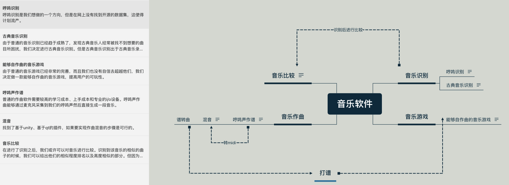

# 立项会议

 * **参会者**：王逸、邱佳荣、申亚宁
 * **时间**：2020年10月25号周日 腾讯会议

## 项目选择
基于Web平台的音乐软件
（后续可以继续项目，将音乐软件变为音乐游戏，开发移动端等）

### 1. 主要技术栈

**分成前端和后端开发**

**前端**：html，css,python。

**后端**：python。

### 2. 团队分工

**前端开发**：王逸

**后端开发**：王逸、申亚宁、邱佳荣

**接口对接**：邱佳荣、申亚宁

### 3. 团队名

seraphfire

## 项目分析（头脑风暴）

### 1. 现有系统的不足

>* 学习成本高
>* 设备要求高，不能够随时记录灵感
>* 音乐游戏比较固定，不能够打自己喜欢的曲子

### 2. 改进方式

- [x] 点击即可录音记录
- [x] 自动转化为midi和曲谱，不用用户操作
- [x] 拖动即可混音
- [x] 一键导出为pdf或者播放，一键导入音乐游戏打歌

### 4. 需求

* 注册

* 登陆

* 用户数据管理

* 录音记录

* .wav转.mid

* 音乐导出曲谱

* 音乐导入音乐游戏

  

## 思维导图

