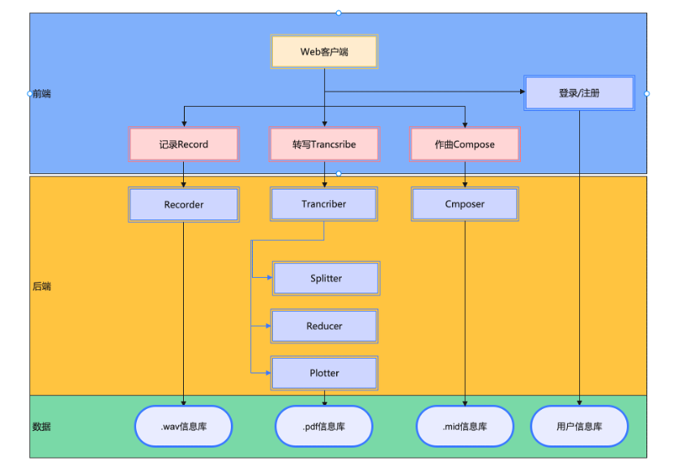
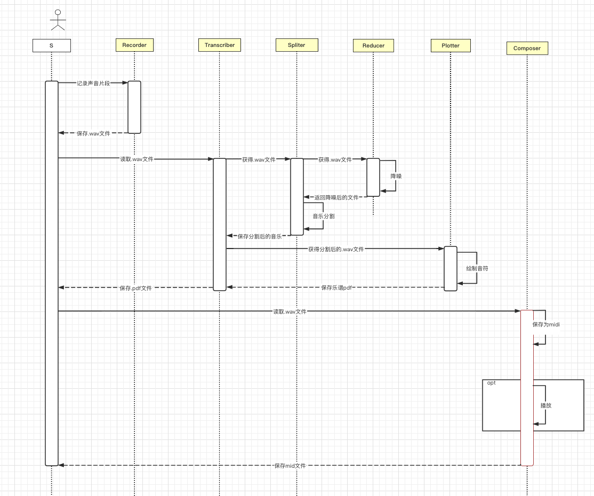

<!-- TOC -->

- [1. 系统结构](#1-系统结构)
    - [1.1. 前端系统结构](#11-前端系统结构)
    - [1.2. 后端系统结构](#12-后端系统结构)
    - [1.3. 系统结构图：](#13-系统结构图)
    - [1.4. 系统类图](#14-系统类图)
    - [1.5. 关键数据结构定义](#15-关键数据结构定义)
        - [1.5.1. 前端数据结构](#151-前端数据结构)
        - [1.5.2. 用户数据项结构设计](#152-用户数据项结构设计)
        - [1.5.3. 课程数据项结构设计](#153-课程数据项结构设计)
        - [1.5.4. 邀请码数据项结构设计](#154-邀请码数据项结构设计)
        - [1.5.5. 课程-学生关系表结构设计](#155-课程-学生关系表结构设计)
        - [1.5.6. 课程讨论结构设计](#156-课程讨论结构设计)
        - [1.5.7. 数据关联结构设计](#157-数据关联结构设计)
    - [1.6. 关键算法设计](#16-关键算法设计)
        - [1.6.1. 数据库的API接口算法设计](#161-数据库的api接口算法设计)
        - [1.6.2. 后端的API接口算法设计](#162-后端的api接口算法设计)
    - [1.7. 数据管理说明](#17-数据管理说明)
        - [1.7.1. 使用数据库概述](#171-使用数据库概述)

<!-- /TOC -->

<a id="markdown-1-系统结构" name="1-系统结构"></a>

# 1. 系统结构

<a id="markdown-11-前端系统结构" name="11-前端系统结构"></a>

## 1.1. 功能说明

系统架构图如架构图所示，用户从web端登录或者注册，进行记录，数据可以录入.wav信息库，用户进行转写，数据可以录入.pdf信息库，用户进行转写，数据可以录入.mid信息库。



1. 前端系统分为三个模块：记录、转写、作曲、登录/注册
2. 后端系统分为三个大类：Recorder，Transcriber，Composer。其中transcriber又分为了Splitter，Reducer，Plotter。
3. 数据部分分为四个库：.wav信息库， .pdf 信息库，.mid 信息库，用户信息库。

## 1.2. 代码结构

### 文件结构：代码

1. /sound_recorder

> 录音，生成wav文件保存在/record_wav

2. /wav_note（很多）

> 提取音符，生成乐谱pdf保存在/note_pdf

3. /compose

>  音符转乐曲，生成mid文件保存在compose_mid

4. handle.py

> rec = record.Recorder()录音，全局变量
>
>  transcriber = music_transcriber.MusicTranscriber(file_name)提取音符
>
>  composer = music.Music()音符转乐器音，全局变量

 

### 文件结构：文件

1. /record_wav

> 录音保存的音频文件

2. /note_pdf

> 乐谱pdf

3. /compose_mid

> 音符转乐曲的结果（项目最终结果）

## 1.3 后端接口

1. 设置乐曲名

  handle.set_music_name("乐曲名")

2. 录音

  handle.start_record()调用这个函数开始录音

  handle.stop_record()录音结束后调用这个函数，生成音频 乐曲名.wav，保存在record_wav文件夹

3. 提取音符

  melody = handle.get_notes()，生成五线谱 乐曲名.pdf 保存在note_pdf文件夹

4. 音符转乐器音（打括号的是非必要函数）

（（1）可以设置乐器）

  handle.choose_program(id) 

（2）音符生成乐器音

  handle.create_melody(melody)，用第3步得到的melody生成乐器音 乐曲名.mid 保存在compose_mid文件夹

（（3）播放）

  handle.play_music()

（（4）mid转wav，需要java环境）

  handle.mid2wav() 

## 1.4. 系统时序图、类图

用户记录声音片段，进入Recorder类。保存后读取.wav文件进入Transcriber类进行转写；此后获得.wav文件，进入Spilter类分离；在分离前，还要进入Reducer类降噪，降噪完以后在spliter进行音乐分解，分解完返回，进入Transcriber中，使用Plotter进行打谱。此时用户就能够得到.pdf文件。进入Comporser中，可以播放或者保存为midi。



用户类包含了乐曲名、乐曲路径、用户名、密码，可以进行记录、转化、作曲。用户可以记录乐曲，Recoder类中包括了乐曲路径，可以进行录音和保存。用户也可以进行转化操作，Transcriber类中包括了音乐、输出路径，可以进行打点（Plotter）和降噪（Enhancer）并且转化操作。用户还可以进行作曲，Composer类中包括了音乐、乐曲名、乐曲路径、乐器、节拍数，可以进行设置乐器、播放、保存为.mid文件，转化为.wav文件的操作。


## 1.5. 关键数据结构定义

<a id="markdown-151-前端数据结构" name="151-前端数据结构"></a>

### 1.5.1. 前端数据结构
1. 登入界面主要数据：username、password分别绑定前端页面的用户名输入框和密码输入框中的内容，并通过axios打包传递给后端服务器进行关联。
2. 注册界面主要数据：username、password、repassword分别绑定前端页面的用户名输入框和密码输入框、确认密码输入框中的内容，并并通过axios打包传递给后端服务器进行关联。
3. 选课主界面主要数据：message是一个具体的字典数组，数组中元素是用来存储每门课的基本信息的，数组元素具体格式如下：
    ```js
    message:{
        name     : " ",   //name表示课程的名字
        score    : " ",   //score表示课程的学分
        week     : " ",   //week表示课程的上课时间
        teacher  : " ",   //teacher表示上课的老师
        classroom: " ",   //classroon表示上课的地点
        signupnum: 0,     //signupnum表示当前报名人数
        maxnum   : 100,   //maxnum表示课程最大人数
        isSignup : " ",   //isSignup表示当前用户是否报名改课程
        classsort: " "    //classsort是这门课程的具体分类
    }
    ```
4. 个人信息界面主要数据：userinf是一个字典，字典用来存储个人信息，字典具体格式如下：

    ```js
    userinf:{
        name : " ",   //name表示用户的昵称
        ID   : " ",   //ID用来表示用户的身份（游客、教师、学生），
        email: " ",   //email表示用户的电子邮箱
        major: " ",   //major用来表示用户的班级
    }
    ```
    classname是一个具体的字典数组，数组中元素是用来存储用户已经选择的每门课的名字以及选课成功率，数组元素具体格式如下：
    ```js
    classname:{
        name       : " ",   //name表示用户选择的课程的名字
        chenggonglv: " "    //chenggonglv表示该课程选课的成功率。
    }
    ```
5. 个人中心主要数据：inf是一个具体的字典，字典是用来存储用户的基本信息的，字典具体格式如下：
    ```js
    inf:{
        nickname   : " ",   //Nickname用来表示用户的昵称
        name       : " ",   //name用来表示用户的真实姓名
        major      : " ",   //major用来表示用户的班级
        ID         : "",    //ID用来表示用户的学号
        phonenumber: "",    //phonenumber用来表示用户的电话号码
        email      : 0,     //email用来表示用户的邮箱
        invisit    : " "    //invisit用来储存教师邀请码
    }
    ```
6. 课程讨论界面主要数据：message是一个具体的字典数组，数组中元素是用来存储用户讨论的基本信息的，数组元素具体格式如下：
    ```js
    message:{
        name: " ",   //Name用来表示用户的昵称
        msg : " ",   //msg用来表示用户的讨论内容。
    }
    ```
7. 课程简介界面主要数据：inf是一个具体的字典，字典是用来存储课程的基本信息的，字典具体格式如下: 
    ```js
    inf:{
        classname   : " ",   //classame用来表示课程名字
        credit      : " ",   //credit用来表示课程学分
        weeks       : " ",   //weeks用来表示课程具体时间
        teacher     : " ",   //teacher用来表示课程老师
        classroom   : " ",   //classroom用来表示课程上课地点
        introduction: " ",   //introduction用来表示课程介绍
        college     : " "    //college用来表示课程学院
    }
    ```
8. 教师上传课程界面主要数据：inf是一个具体的字典，字典是用来存储课程的基本信息的，字典具体格式如下：
    ```js
    inf:{
        classname   : " ",   //classame用来表示课程名字
        credit      : " ",   //credit用来表示课程学分
        weeks       : " ",   //weeks用来表示课程具体时间
        teacher     : " ",   //teacher用来表示课程老师
        classroom   : " ",   //classroom用来表示课程上课地点
        introduction: " ",   //introduction用来表示课程介绍
        college     : " "    //college用来表示课程学院
    }
    ```

<a id="markdown-152-用户数据项结构设计" name="152-用户数据项结构设计"></a>
### 1.5.2. 用户数据项结构设计
用户数据项的表项代码设计如下：
``` python
#对应每个用户由一个信息大表记录，后续再通过多复杂关系修改该表
#一个用户的数据表项
class User(db): 
    __tablename__ = 'users'
    id            = Column(Integer,primary_key = True,autoincrement=True)
    Username      = Column(String(255),unique = True) #一个人的昵称，要有唯一性
    Truename      = Column(String(30)) #一个人的真实姓名，可能有重名的现象
    Sex           = Column(Integer) #性别 0代表男，1代表女
    Phonenumber   = Column(String(60)) #电话号
    Nickname      = Column(String(50)) #昵称
    Userid        = Column(String(30),unique=True) #一个人的学号，具有唯一性
    Email         = Column(String(50),unique=True) #一个人的邮箱，具有唯一性
    Password      = Column(String(255)) #加密的密码
    Sign_time     = Column(DateTime,default=datetime.datetime.now)
    Role          = Column(Integer,autoincrement=False)#表示某一个用户的权限等级, 有 0:'admin', 1:'teacher', 2:'student'
    Classes       = Column(String(30)) #班级
    College       = Column(String(30)) #学院
    def check_password(self,password): 
        return check_password_hash(self.Password,password)
```
上表为一个具体的用户数据项表，将老师，学生，以及管理员抽象为一种数据类型，表名定义为users，其他成员具体解释如下：
1. Id: 为数据库存取时的唯一索引，具有自增属性，数值为数据库自动为其分配。
1. Username: 该用户的用户名，具有唯一性，为该用户逻辑上的唯一标识，Username在用户注册时，自己命名。
1. Truename： 对于选课系统来说，需要用户的真实姓名，考虑到真实应用场景，故每个用户提供一列以字符串形式保存真实姓名。
1. Sex：用户性别，为了方便读取时的判别，故设计为整型，且只有两种理论值，0：男，1：女。
1. Phonenumber: 用户的手机号，以字符串形式存储，具有唯一性。
1. Nickname: 用户昵称，区别于用户名（仅自己可见，为逻辑唯一标识），昵称为对外显示，非高权限（如选课老师）可见的标识。
1. Userid: 用户的学号，对身份为学生的用户有效，同样区别于id，id为数据库分配的自增唯一索引，而Userid为学校分配的id。
1. Email: 用户的邮箱，具有唯一性，之后可以用作验证。
1. Password: 用户的密码，密码为用户自己设置的，为了保证私密性，故在数据库中使用了哈希加密，在外层调用接口时，只能调用接口的验证函数，无法获取密码的表项。
1. Sign_time: 用户注册的时间，用作特殊记录用。
1. Role: 表示用户的身份，与Sex的方式类似，使用整型来记录，0代表管理员，1代表老师，2代表学生；
1. Classes：用户当前的课程定义；
1. College: 用户当前的学院，为必填项；
1. 函数成员check_password(): 为封装的密码查询，保证外部调用无法直接获取密码。

<a id="markdown-153-课程数据项结构设计" name="153-课程数据项结构设计"></a>
### 1.5.3. 课程数据项结构设计
```python
class Course(db): 
    __tablename__ = 'courses'
    id            = Column(Integer, primary_key=True, autoincrement=True)
    Coursename    = Column(String(40), nullable=False,unique=True)
    State         = Column(Integer,nullable=False) #表示当前课程状态，0为预备
    Credit        = Column(String(10)) #表示学分
    Weeklast      = Column(String(20))
    Deadline      = Column(String(40))
    Type          = Column(String(20),nullable=False) #课程类别，0默认为未分类

    #总人数
    Allstu = Column(Integer)

    #上课地点
    Course_location = Column(String(50))
    #课程描述
    Course_content = Column(String(1024))
    #上课人数
    Stu_num = Column(Integer,nullable=False)
    #上课时间
    Course_time = Column(String(100)) #采用格式化字符串的形式，存储上课的时间信息
    #每个课程关联唯一的一个负责老师
    Teacherid = Column(Integer, ForeignKey('users.id'))
    #学生与课程的多对多关系
    String_state = Column(String(100))
    Stus         = relationship('User', secondary=Course_stu,
                        #cascade = "delete, delete-orphan",
                        backref  = 'Courses',               lazy = 'dynamic')
```
以上为课程项表，即表示一个课程的所有信息。
1. Coursename: 该课程名，具有唯一性，同时也是逻辑意义上的课程唯一标识，接口函数多以此为查找索引。
1. State： 表示当前课程的状态，分为预选和完成状态，在预选阶段允许人数超额，在预选结束，课程人数固定。0表示为预选，1表示为成功选上；
1. Credit： 记录该课程的学分，为整型；
1. Weeklask: 表示该课程持续的周，为字符串存储；
1. Deadline: 表示课程的截止日期，为字符串形式；
1. Type: 课程类别，使用字符串，以字节流的形式存储，来表示该课程属于哪一个学院的；
1. Allstu：表示目前选该课程的人数，为整型；
1. Course_location: 表示课程的上课地点，以字符串形式；
1. Course_content: 表示课程内容描述，以字符串形式保存，最大允许长度为1024，为老师发布；
1. Stu_num: 上课人数，即当课程结束预选状态后，用来保存课程成功选课的人数；
1. Course_time: 表示课程上课时间，以字符串形式保存；
1. Teacher_id: 因为每个课程对应一个唯一的老师，故使用外键，将一个老师id做为一个课程的唯一索引；
1. String_state: 表示学生的选择状态，以字符串字符流来表示；
1. Stus： 构建课程与学生的多对多映射，以Couses为反向映射键，具体定义在table中。

<a id="markdown-154-邀请码数据项结构设计" name="154-邀请码数据项结构设计"></a>
### 1.5.4. 邀请码数据项结构设计
邀请码的结构如下：
```python
#存储邀请码的表项
class Visit(db):
    #存储邀请码的库
    __tablename__ = 'visits'
    id            = Column(Integer,primary_key=True,autoincrement=True)
    Visit_code    = Column(String(50),unique=True)
    #一对一的关系
    Teacherid = Column(Integer,ForeignKey('users.id'))
#   
```
邀请码表项包括：
1. Visit_code: 邀请码，以字符串表示
1. Teacherid: 一个邀请码最多只能绑定一个老师，即在未使用时，该列为None，在绑定之后变为对应老师的id，不允许多次绑定；

<a id="markdown-155-课程-学生关系表结构设计" name="155-课程-学生关系表结构设计"></a>
### 1.5.5. 课程-学生关系表结构设计
以下为课程，学生的多对多关系表。
```python
#构建的课程-学生的多关系表
Course_stu = Table('Course_stu',
                   db.metadata, #对于老版本的Table，需要显式调用
                   Column('User.id',Integer,ForeignKey('users.id',ondelete='CASCADE',onupdate='CASCADE')),
                   Column('Course.id',Integer,ForeignKey('courses.id', ondelete='CASCADE',onupdate='CASCADE')) #实现级联删除的作用
                   )
```
详细表述如下：构建一个关系表，关联User与Course,此处User指选择该课的学生，多对多的含义即一个课程里面存在多个学生，同样一个学生也可以对应多个课程。
<a id="markdown-156-课程讨论结构设计" name="156-课程讨论结构设计"></a>
### 1.5.6. 课程讨论结构设计
课程讨论表项的定义如下：
```python
#讨论数据库
class Discussion(db): 
    __tablename__ = 'discussions'
    id            = Column(Integer, primary_key=True, autoincrement=True)
    Content       = Column(String(255)) #讨论内容，限长255
    Courseid      = Column(Integer, ForeignKey('courses.id')) #每个讨论对应一个课程
    Userid        = Column(Integer, ForeignKey('users.id')) #每个讨论对应一个发言人
    Sign_time     = Column(DateTime, default=datetime.datetime.now) #发表时间
    Username      = Column(String(255)) #便于查找，存储用户名
    Coursename    = Column(String(40)) #同上，课程名
```
具体信息解释如下：
1. Content: 表示该讨论的具体内容，限制长度为255，若超长，则返回报错信息；
1. Courseid: 每条讨论对应唯一的课程标识，可以通过课程id来查找所有的该课程的评论；
1. Userid：同样，每条评论对应一个唯一的发表人；
1. Sign_time: 记录该评论的发表时间；
1. Username： 为了节约查询开销，故记录发表该评论的用户名；
1. Coursename：同上，为了节约开销，记录与之关联的课程名称；

<a id="markdown-157-数据关联结构设计" name="157-数据关联结构设计"></a>
### 1.5.7. 数据关联结构设计
前后端数据关联，分页面介绍如下
1. register.html页面的前后端数据关联
前端传入username和password到用户数据库username和password中。
2. login.html页面的前后端数据关联
前端传入的username和password和用户数据库的数据进行匹配。
3. home.html页面的前后端数据关联 
后端读取出来所有课程的缤纷信息，读出所有课程的Coursename，Credit，Weeklast，Teacherid，Course_location，Stu_num，Maxnum，然后视情况将Teacherid转化为id对应的username或者Nickname，然后对于没有登录的用户，其isSignup=”否”，对于登录的用户，如果其在课程成员里其值为是，否则为否，然后对应的信息按类别存到对应的list中。返回到前端即使用jinjia模板渲染，前端的name对应的这里的Coursename，score对应的Credit，week对应的Weeklast，teacher对应的Teacherid转化的值，classroom对应的Course_loaction，signupnum对应的这里的Stu_num，maxnum对应这里的Maxnum，isSignup对应这里的isSignup，classsort对应这里的type_name（由数据库中的Type转化而来）
4. 个人信息页面的前后端数据关联
用户登录后，使用当前会话的username从数据库中获取一条用户的信息，前端的name对应后端数据库信息中的Nickname并经过一定的转化（将None变成空），前端的ID对应后端的Role表项，后端的Role表项和数据库信息的Role表项的对应关系是{None:”空”, 0:”管理员”, 1:”老师”, 2:”学生”}
前端的email对应着后端的数据库信息的Email项，前端的major对应着后端的Classes项。
根据用户的名字获得其选择的所有课程，组成一个列表。
前端的每一个classname中的name对应着列表中一个项的Coursename，每一个概率对应的列表中的一个课程中的元素按一定规则计算后得到的概率。
5. 个人信息更改页面的前后端数据关联
根据用户登录时的username获得当前用户名对应的数据库中的一个表项。
前端的nickname对应后端数据库表项中的Nickname，name对应的是表项中的Truename，major对应的后端数据库表项中的Classes，ID对应的是后端数据库的Userid，phonenumber对应的是数据库表项中的Phonenumber，email对应的数据库中的Email，invisit对应的是邀请码，传入后端后通过查找逻辑来改变当前用户的身份。
6. 课程讨论界面的前后端数据结构关联
首先获得数据库中所有的讨论项。
讨论区的每一个讨论的name对应的是数据库中一个表项的Username项
每一个讨论的time对应的是数据库中一个表项的Sign_time
每一个讨论的Score是数据库中一个表项的Content
7. 课程简介界面的前后端数据关联
首先根据url中的特定id从数据库中获得特定课程的信息表项。
前端的classname对应的后端信息表项的Coursename，credit对应的后端表项的Credit，前端的weeks对应的后端表项的Weeklast， 前端的teacher对应的是teacher的用户名，classroom对应的是数据库表项中的Course_location，introduction对应的是后端数据库的Course_content，
college对应的是数据库中的type经过对应字典映射后的结果。
8. 教师上传课程界面前后端数据关联
前端的classname对应的后端数据库表项数据库表项中的Coursename，前端的credit对应的是后端Credit，weeks对应的是数据库的Weeklast，前端的teacher对应后端数据中课程的username，classroom对应的是数据库中的Course_location。前端的introduction对应的数据库中的Course_content，前端的college经过type字典映射后对应数据库中的Type
数据关联的示意图如下：


<a id="markdown-16-关键算法设计" name="16-关键算法设计"></a>
## 1.6. 关键算法设计
<a id="markdown-161-数据库的api接口算法设计" name="161-数据库的api接口算法设计"></a>
### 1.6.1. 数据库的API接口算法设计

为了配合以上ORM数据库的数据结构使用，故特别封装了数据库的相关操作接口，以简化调用操作。具体函数定义如下：
1)	Add_User(username,password) : 实现基本增操作，传入账号密码，完成注册
2)	Delete_User(username) ： 根据用户名，删除数据库中对应的记录
3)	Refresh_User(self,username,user_info)：更新用户的详细信息,需要传入参数，关于该用户的用户名，以及需要修改的表项，以字典形式传入
4)	Get_User(self,username)： 数据库对某一名字进行查询,获得一个用户信息列表
5)	Get_Coursename(self, type, name)：根据课程id，得到课程的名称
6)	Is_Exist(self,type,name)：查询数据库中的信息是否存在
7)	Refresh_Course(self,Coursename,course_info)：修改课程，主要用来对课程内容进行进一步的修改
8)	Create_Course(self,username,course_info)： 添加课程；
9)	Get_Course(self,Coursename)：获取全部课程信息
10)	Get_Allcourse(self)： 获得数据库中所有的课程名，返回列表，若无，返回None
11)	Delete_Course(self,Coursename)：删除课程
12)	Add_Stu(self,Stu_list,Coursename)：学生进入某个课程
13)	Quit_Stu(self,Stu_name,Coursename)：学生退出某个课程
14)	Get_Stucourse(self,Stuname)：根据学生用户名，得到该学生选的所有课程名,由于函数内调用，不添加鲁棒性报错
15)	Get_Teachercourse(self,Teachername)：根据老师用户名，查找所有的老师课程信息,若无，返回None
16)	Get_Coursemember(self,Coursename)：根据课程名称查询选该课的学生以及老师（唯一）
17)	Add_Visitcode(self,code_list)：创建邀请码，传入一个列表，包含一批邀请码，要求不能有重复
18)	Bind_Visitcode(self,username,code)：将一个邀请码与一名用户绑定，绑定成功，则更改用户的权限为教师
19)	Upload_discussion(self, coursename, username, content)：上传讨论内容，传入课程名称，用户名，以及讨论内容
20)	Get_Coursediscussion(self, coursename)：根据课程名称，返回该课程的所有讨论内容，返回值为一列表
21)	Check_User(self,username,password)：核对密码是否正确
22)	Init_DB(self)：对数据库进行建立操作
23)	Close_DB(self)：关闭数据库，测试或初始化用

<a id="markdown-162-后端的api接口算法设计" name="162-后端的api接口算法设计"></a>
### 1.6.2. 后端的API接口算法设计
1. `@bp.route('/register', methods=('GET', 'POST'))`
实现用户创建账号，能根据各种情况完成用户注册的后端功能，包括前端数据结构完备性检查，以及调用后端数据库的接口函数将前端获取的数据加入到数据库中，以及向前端返回对应的操作消息。

2. `@bp.route('/login', methods=('GET', 'POST'))`
响应前端的GET请求，完成前端页面的显示，并根据前端传输的信息，在数据库中记性查询，并返回数据库中查询的结果，如果登陆出错则将出错信息弹窗到页面上，如果登陆成功，则跳转到主页面。

3. `@bp.route('/', methods=('GET', 'POST'))`
能够展示当前所有的课程以及其信息，并且能够根据对应的按钮实现对应的功能。

4. `@bp.route('/class_info2', methods=('GET', 'POST'))`
通过前端的post信息生成特定的url以供class_info函数使用。

5. `@bp.route('/<int:id>/class_info', methods=('GET', 'POST'))`
根据传入的特定课程的url返回对应渲染页面。

6. `@bp.route('/message2', methods=('GET', 'POST'))`
实现用户注销功能。

7. `@bp.route('/message1', methods=('GET', 'POST'))`
实现选课和退选功能。

8. `@bp.route('/user', methods=('GET', 'POST'))`
实现个人中心的页面，能够针对不同身份的人进行不同身份的显示。

9. `@bp.route('/setting', methods=('GET', 'POST'))`
GET请求时显示当前用户在数据库中已经填写的数据，POST请求时根据其填写的数据完成用户在数据库中数据的更新。

10. `@bp.route('/classinfo', methods=('GET', 'POST'))`
实现老师发布新课程。

11. `@bp.route('/class_discussions', methods=('GET', 'POST'))`
实现自由讨论区的功能。

12. `@bp.route('/message_x', methods=('GET', 'POST'))`
完成特定课程的url生成。

13. `@bp.route('/<int:course_id>/class_comments', methods=('GET', 'POST'))`
实现针对特定课程的评价区。

<a id="markdown-17-数据管理说明" name="17-数据管理说明"></a>
## 1.7. 数据管理说明
本项目为基于Python中的Flask框架搭建的Web选课平台，为了便于数据的存取，后台使用了 Mysql+pymysql 的数据库框架，底层使用单机的Mysql数据库进行数据的存储。
考虑到Web开发中数据关系的复杂性，故在项目中使用了对象关系映射器技术（Object Relational Mappers，ORM），即python中较有名的ORM框架，SQLAlchemy。

<a id="markdown-171-使用数据库概述" name="171-使用数据库概述"></a>
### 1.7.1. 使用数据库概述
1. Mysql
MySQL 是最流行的关系型数据库管理系统，在 WEB 应用方面 MySQL 是最好的 RDBMS(Relational Database Management System：关系数据库管理系统)应用软件之一。MySQL 是一种关联数据库管理系统，关联数据库将数据保存在不同的表中，而不是将所有数据放在一个大仓库内，这样就增加了速度并提高了灵活性。
2. SQLAlchemy
SQLAlchemy 在Python Web 框架中得到了广泛应用，它是一个Python的ORM框架，ORM就是把数据库表的行与相应的对象建立关联，互相转换。由于像Mysql关系数据库的多个表还可以用外键实现一对多、多对多等关联，相应地，ORM框架也可以提供两个对象之间的一对多、多对多等功能。
使用 SQLAlchemy等独立 ORM 的一个优势就是它允许开发人员首先考虑数据模型，并能决定稍后可视化数据的方式。ORM作为顶层，即将表项的数据结构抽象出来，方便程序员在程序中设计数据关系，通过engine转换为底层数据库的API，进而实现对底层数据库的读写。