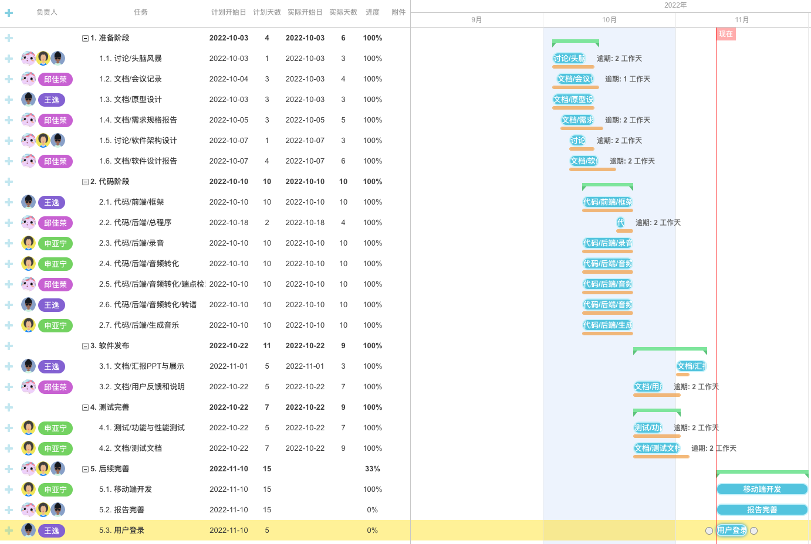

## 任务分解
文档编写：邱佳荣

1. 进度计划
2. 系统设计
3. 需求规格
4. 实现与测试
5. 用户反馈

---

前端设计：王逸

1. 登录功能、注册功能
2. 页面框架设计
----

算法设计：邱佳荣、王逸、申亚宁
1. 录音
2. 转换-降噪算法
3. 转换-生成音符算法
4. 转换-音符切割算法
5. 生成音乐

----

集成测试：申亚宁

1. 服务器部署
2. 域名解析
3. 服务器维护
4. 内网管理端口

----

后续完善：邱佳荣、王逸、申亚宁

1. 打谱功能
2. 接入数据库
3. 导入到音乐游戏
4. 多分类

----

发布：王逸、申亚宁、邱佳荣

## 进度安排

在线链接：https://gantt.mindsup.cn/share/9pnslSqIh

