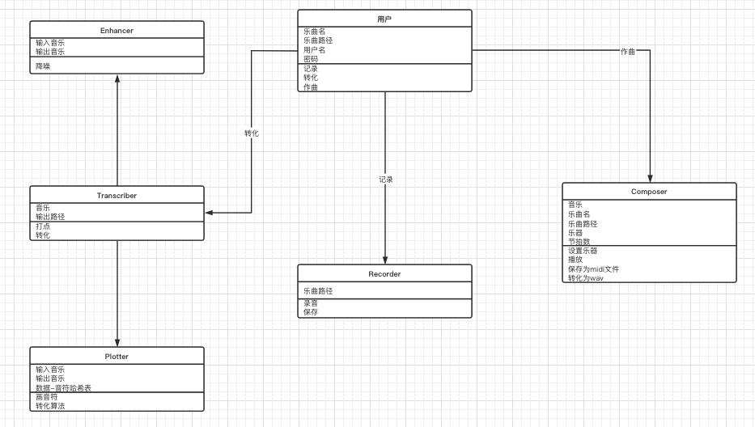
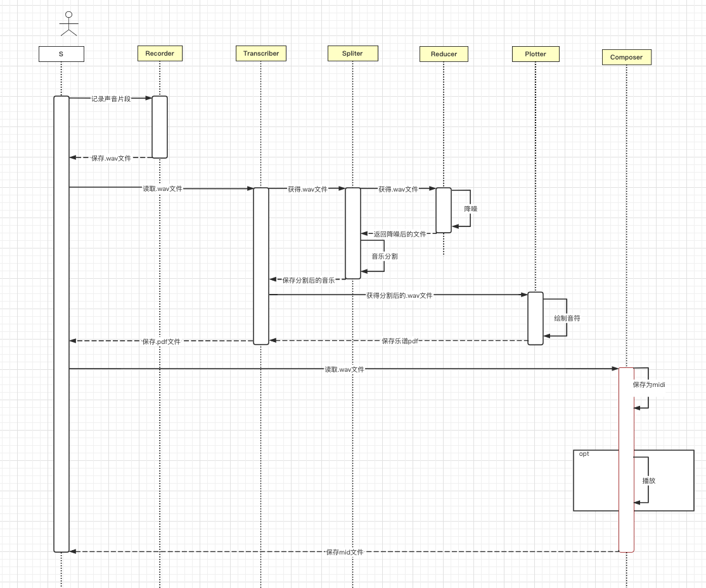
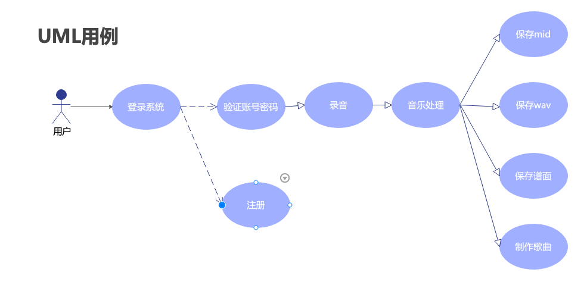
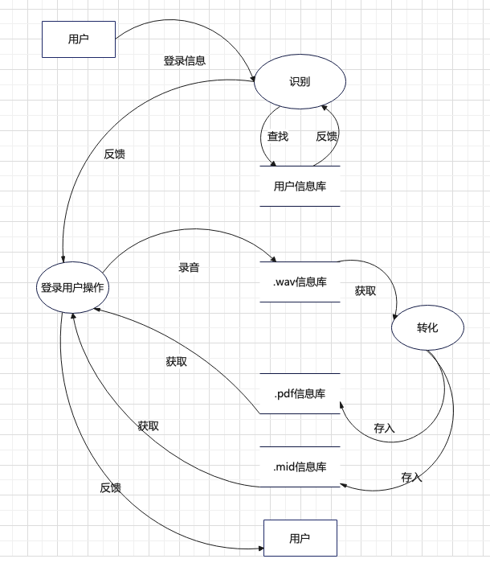
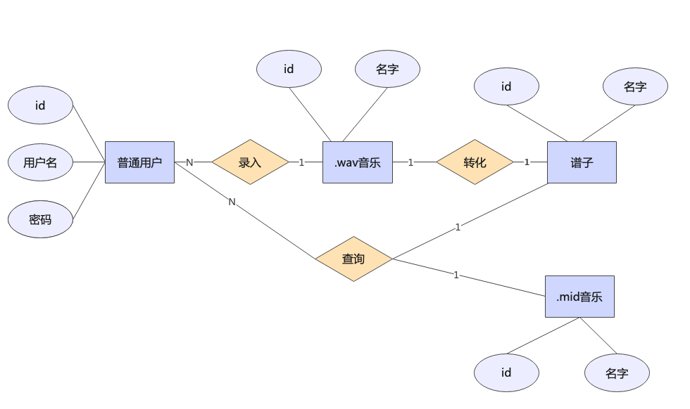
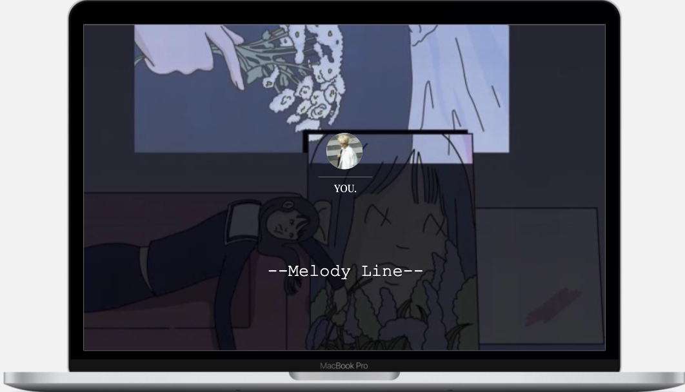
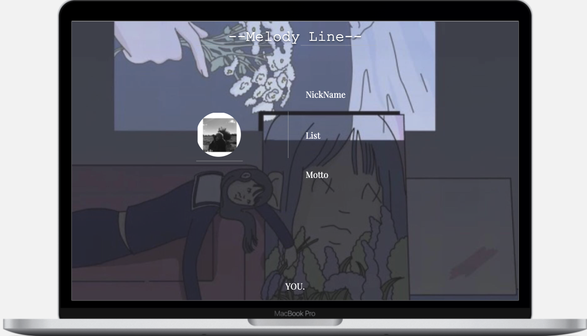
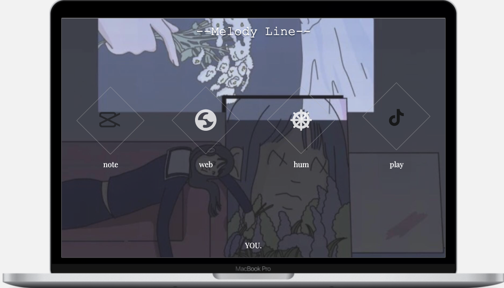
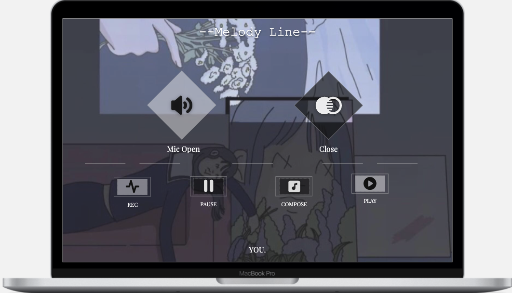
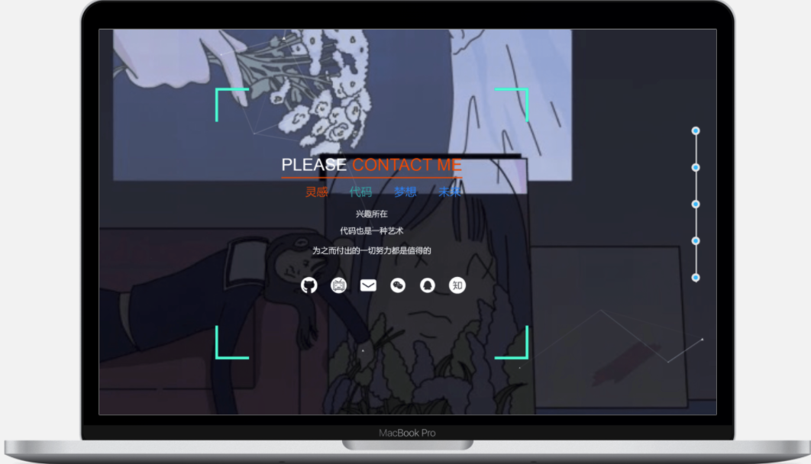

## 产品描述

经过小组讨论我们决定以网站的形式实现我们的选课系统，后续可能会部署在移动端或者电脑客户端，在项目管理上使用Gitee（Github）平台对我们的代码和资源文件进行管理，构建用于存储用户信息和课程信息的数据库。我们的基本目标是在网页上实现一个音乐处理软件。

## 产品功能

登录、注册、录音、音乐处理、输出并保存mid、输出并保存wav、输出并保存谱面、制作音乐游戏歌曲。

## UML图

## 系统用例

系统中仅有的角色就是用户，其用例图如下：

## 系统数据流图

系统运行数据流图如下

## 系统ER图
有上述描述可以得到系统的ER图如下

## 系统功能描述

基于web开发，因此初步设计五个页面，登入界面、个人界面、使用说明、音乐播放界面、结束界面。

原型： https://modao.cc/app/7ixdJWtxrkte5cIUBmBiF 

### 用户登入

点击圆框，未登录显示需要用户的用户名以及密码，以及需要一个登陆按键来支持页面的跳转，以及向后端发送post请求。其次还要有创建账号的按键提供用户进行选择，用户点击创建账号应该可以跳转到注册账号的信息，给用户提供注册功能。如果登录了，点击圆框会进入下一个界面。

### 个人界面

个人界面展示我们用户名，头像，以及个人生成的歌曲、谱子。

### 使用说明

点击web查看网页端用法，点击下载可以下载相应的客户端。

###	音乐处理

四个模块查看，点击rec开始录音，点击pause暂停，然后点击compose转化，点击play播放。

### 结尾

拖动到网页最后，显示页尾，有源代码等各种信息。
